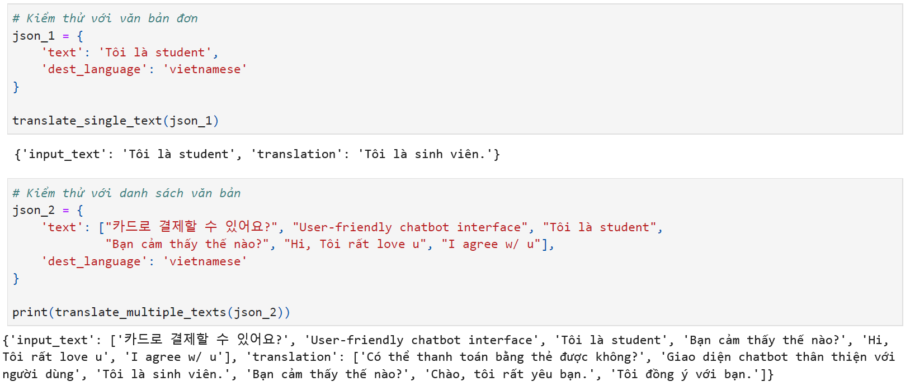
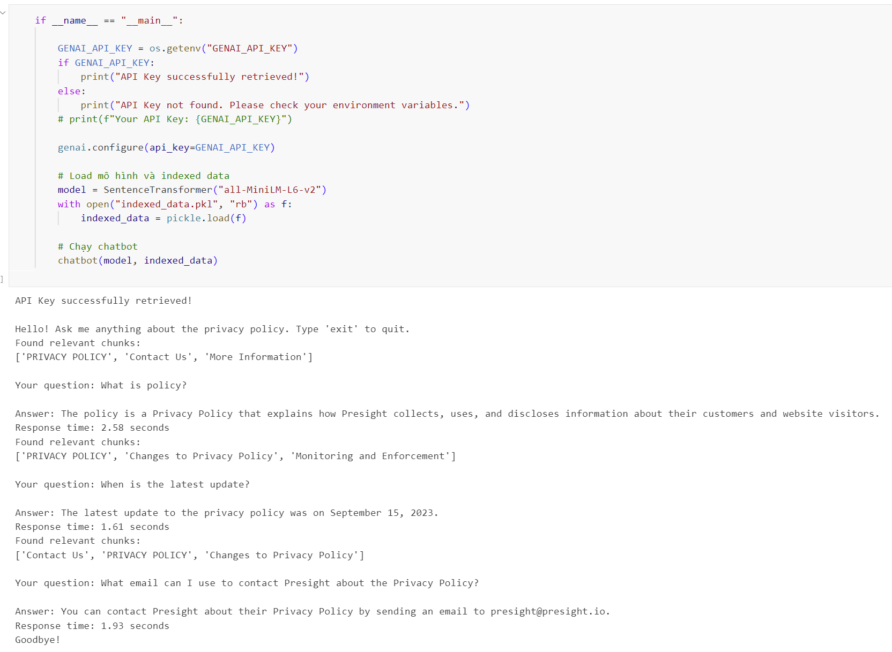
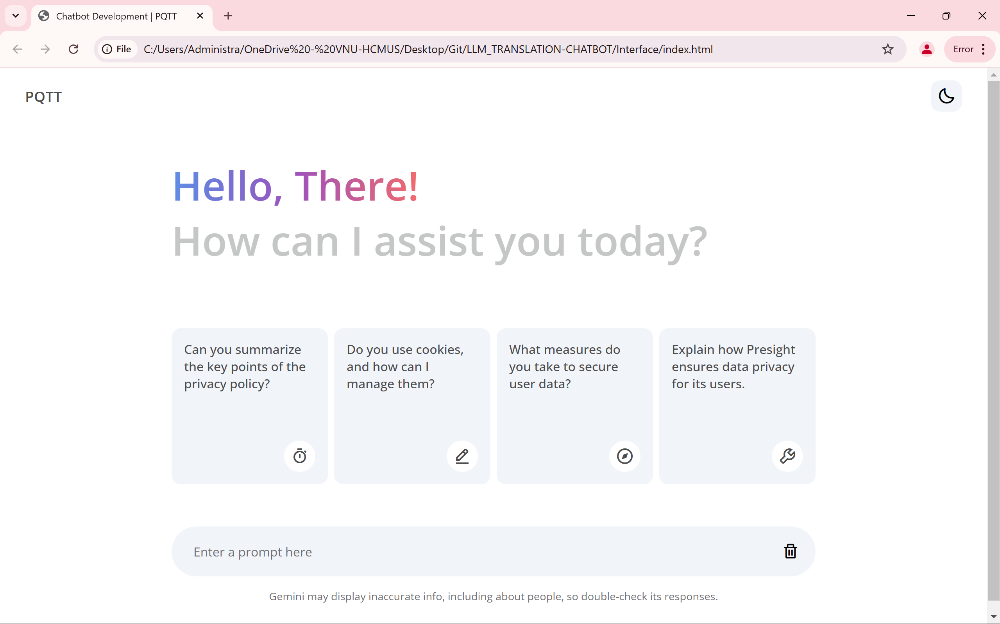

# LLM_TRANSLATION-CHATBOT

## Description

This project focuses on integrating a large language model (LLM) to accomplish two main tasks: `language translation` and `chatbot` development from website data.

- **Part 1: Language Translation**

    The system uses the `Gemini API` to translate text into Vietnamese. It can process either a single text or a list of multiple texts while ensuring that if the text is already in the target language, it remains unchanged.

- **Part 2: Web-Based Chatbot**

    The chatbot requires collecting information from a specific website, preprocessing the data, indexing it for search, and developing a chatbot capable of answering questions based on the gathered content. It utilizes **NLP** to find the most relevant text from the website data and then feeds it into the **LLM** to generate accurate responses.

    Here is the link to the website: [presight](https://www.presight.io/privacy-policy.html)

This project integrates `web crawling`, `NLP` (natural language processing), and `AI` (artificial intelligence) to build an intelligent chatbot system and facilitate automatic translation.

## Results

**1. Translation**

- Supports translating both single texts and lists of texts into Vietnamese.

- Detects the input language and keeps the text unchanged if it is already in Vietnamese.

    **Example**

    - Input: "Hello" 
    → Output: "Xin chào"

    - Input: ["Hello", "How are you?", "Tôi là sinh viên"] 
    → Output: ["Xin chào", "Bạn khỏe không?", "Tôi là sinh viên"]

    

**2. Chatbot** 

- Collects data from [Presight](https://www.presight.io/privacy-policy.html), processes it, and creates a search index.

- Uses NLP to find the most relevant passage from the website data and generates answers using LLM.

    **Example**

    - Question: "What is Presight’s privacy policy?"

    - Chatbot response: "The policy is a Privacy Policy that explains how Presight collects, uses, and discloses information about their customers and website visitors."
    
    

**3. Web Interface for Chatbot**

* **Objective**: Enable users to easily query information from [Presight's](https://www.presight.io/privacy-policy.html) policies through an online chatbot.

* **KEY FEATURES**

    - *Simple and intuitive interface*: users can enter questions in the chat box and receive instant responses.

    - *Direct connection to chatbot `backend`*: the system sends queries to the backend, processes them using NLP, and returns relevant answers.

    - *Displayed information with source citations*: responses may include citations from Presight’s policies, allowing users to verify the information.

    - *Conversation history*: users can review previous questions to track information.

* **Demo & Illustrations**: The demo video is attached to the project.

    